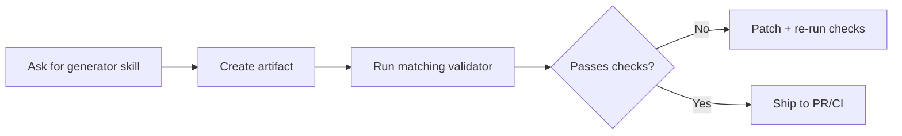

# DevOps skills for Claude Code and Codex

[](https://github.com/hesreallyhim/awesome-claude-code)

A practical skill pack for DevOps work in Claude Code and Codex desktop.

This repository ships **31 skills**:
- **16 generators** for scaffolding production-ready configs
- **14 validators** for linting, security checks, and dry-run validation
- **1 debugger** (`k8s-debug`) for cluster troubleshooting

The goal is simple: make infra and pipeline work faster without skipping correctness checks.

## Quick Install

### Claude Code Plugin Marketplace

```bash
/plugin marketplace add akin-ozer/cc-devops-skills
/plugin install devops-skills@akin-ozer
```

### Codex Desktop

```bash
$skill-installer install https://github.com/akin-ozer/cc-devops-skills/tree/main/devops-skills-plugin/skills
```

### Team Rollout

Add this to project-level `.claude/settings.json`:

```json
{
  "extraKnownMarketplaces": {
    "devops-skills": {
      "source": {
        "source": "github",
        "repo": "akin-ozer/cc-devops-skills"
      }
    }
  }
}
```

## Drop-In GitHub Action Wrapper

This repository also publishes a **drop-in wrapper** around `anthropics/claude-code-action@v1`.

Replace:

```yaml
uses: anthropics/claude-code-action@v1
```

With:

```yaml
uses: akin-ozer/cc-devops-skills@v1
```

Behavior stays compatible with upstream `v1`, and DevOps skills are injected by default through:

- Marketplace: `https://github.com/akin-ozer/cc-devops-skills.git`
- Plugin: `devops-skills@akin-ozer`

Tag policy:

- `akin-ozer/cc-devops-skills@v1` tracks this wrapper's latest `v1.x.y` release.
- The wrapper internally calls `anthropics/claude-code-action@v1` (tag), not a pinned SHA.

To run as pure passthrough (no auto-injection):

```yaml
uses: akin-ozer/cc-devops-skills@v1
with:
  inject_devops_skills: "false"
```

Docs and examples:

- Wrapper details: [`docs/drop-in-wrapper.md`](docs/drop-in-wrapper.md)
- IaC PR review workflow: [`examples/github-actions/iac-pr-review.yml`](examples/github-actions/iac-pr-review.yml)
- Compatibility drift check: [`scripts/check_upstream_action_surface.sh`](scripts/check_upstream_action_surface.sh)

## How people use this repo

Most workflows are generator + validator loops.



Typical prompts:

```text
Use terraform-generator to scaffold a reusable AWS VPC module with outputs and examples.
Validate ./infra/vpc with terraform-validator and list only high-severity findings.
Use k8s-debug to diagnose pods stuck in Pending in namespace payments.
```

## What makes these skills useful

- **Local-first validation pipelines**: many validator skills run shell/Python checks directly from their `scripts/` folders.
- **Tool-aware workflows**: validators integrate with real tools like `terraform`, `tflint`, `checkov`, `helm`, `kubeconform`, `actionlint`, and `act`.
- **CRD/provider documentation lookup**: Kubernetes/Helm/Terraform/Terragrunt/Ansible flows include explicit doc lookup paths for custom resources.
- **Fallback behavior is defined**: when a tool is missing, many skills degrade gracefully and tell you exactly what was skipped.

## Skill catalog (31)

### Infrastructure as code (6)

| Skill | Primary use |
|---|---|
| `ansible-generator` | Scaffold playbooks, roles, inventories, and vars |
| `ansible-validator` | Validate/lint/security-check playbooks, roles, and inventories |
| `terraform-generator` | Generate Terraform modules/resources/variables/outputs |
| `terraform-validator` | Run Terraform validation, linting, security audit, and planning |
| `terragrunt-generator` | Scaffold Terragrunt root/child/stack layouts |
| `terragrunt-validator` | Validate Terragrunt HCL, stacks, and module wiring |

### CI/CD pipelines (8)

| Skill | Primary use |
|---|---|
| `azure-pipelines-generator` | Generate `azure-pipelines.yml` and reusable templates |
| `azure-pipelines-validator` | Validate syntax/security/best-practice rules for Azure Pipelines |
| `github-actions-generator` | Scaffold workflows and `action.yml` actions |
| `github-actions-validator` | Validate and test workflows under `.github/workflows` |
| `gitlab-ci-generator` | Generate `.gitlab-ci.yml` pipelines and job stages |
| `gitlab-ci-validator` | Validate and secure GitLab CI configs |
| `jenkinsfile-generator` | Generate declarative/scripted Jenkinsfiles |
| `jenkinsfile-validator` | Validate Jenkinsfiles and shared-library pipeline code |

### Containers and Kubernetes (7)

| Skill | Primary use |
|---|---|
| `dockerfile-generator` | Create production-friendly Dockerfiles |
| `dockerfile-validator` | Lint and security-check Dockerfiles |
| `helm-generator` | Scaffold Helm charts, values, and templates |
| `helm-validator` | Validate chart structure, templates, schemas, and CRD usage |
| `k8s-yaml-generator` | Generate Kubernetes manifests (including CRDs) |
| `k8s-yaml-validator` | Validate/lint/dry-run Kubernetes YAML |
| `k8s-debug` | Troubleshoot runtime cluster failures |

### Observability and Logging (6)

| Skill | Primary use |
|---|---|
| `fluentbit-generator` | Generate Fluent Bit pipelines (`INPUT`/`FILTER`/`OUTPUT`) |
| `fluentbit-validator` | Validate Fluent Bit config quality and safety |
| `logql-generator` | Build LogQL queries and alert expressions |
| `loki-config-generator` | Generate Loki server configs for common deployment modes |
| `promql-generator` | Generate PromQL queries, recording rules, and alerts |
| `promql-validator` | Validate and optimize PromQL queries/alerts |

### Scripting and Build (4)

| Skill | Primary use |
|---|---|
| `bash-script-generator` | Create shell scripts and CLI helpers |
| `bash-script-validator` | Validate shell scripts with ShellCheck-oriented checks |
| `makefile-generator` | Generate Makefiles with reusable targets |
| `makefile-validator` | Validate Makefile correctness and anti-patterns |

## Validator Internals (examples)

These are real execution patterns inside the skill instructions and scripts:

| Skill | Validation pattern |
|---|---|
| `terraform-validator` | `terraform fmt` -> `tflint` -> `terraform validate` -> Checkov -> optional `terraform plan` |
| `k8s-yaml-validator` | CRD detection -> `kubeconform` schema checks -> `kubectl --dry-run` flow |
| `helm-validator` | `helm lint` -> `helm template` -> `kubeconform` -> optional cluster dry-run |
| `github-actions-validator` | `actionlint` static checks + `act` runtime workflow tests |
| `gitlab-ci-validator` | syntax + best-practice + security checks with strict/test-only modes |
| `ansible-validator` | syntax/lint/check-mode + role tests + security checks |
| `dockerfile-validator` | scripted lint/security path with fallback scanning modes |

## Requirements

You do not need every tool for every skill. Install the tools for the domains you use.

### Baseline

- `bash`
- `python3` (3.8+ recommended; 3.9+ for some security tooling)

### Common Toolchain by Domain

| Domain | Common tools |
|---|---|
| Terraform/Terragrunt | `terraform`, `tflint`, `terragrunt`, `checkov` |
| Kubernetes/Helm | `kubectl`, `kubeconform`, `helm`, `yamllint` |
| Docker | `hadolint` |
| GitHub Actions | `actionlint`, `act` |
| Shell scripting | `shellcheck` |
| Prometheus | `promtool` |

### Quick Install (macOS example)

```bash
brew install terraform tflint terragrunt helm kubeconform kubectl hadolint
brew install actionlint act shellcheck prometheus yq fluent-bit
pipx install ansible ansible-lint checkov yamllint molecule
helm plugin install https://github.com/databus23/helm-diff
```

## Repo Layout

```text
cc-devops-skills/
├── action.yml
├── README.md
├── LICENSE
├── docs/
│   └── drop-in-wrapper.md
├── examples/
│   └── github-actions/
│       └── iac-pr-review.yml
├── scripts/
│   └── check_upstream_action_surface.sh
├── .github/workflows/
│   └── compat-check.yml
└── devops-skills-plugin/
    ├── .claude-plugin/plugin.json
    └── skills/
        └── <skill-name>/
            ├── SKILL.md
            ├── scripts/
            ├── references/
            ├── assets/
            ├── examples/
            └── tests/ (or test/)
```

## Contributing

Contributions are welcome for:
- new skills in adjacent DevOps domains
- better validator coverage and safer defaults
- test fixtures and regression tests
- improved docs/examples for real production scenarios

## License

Apache-2.0
